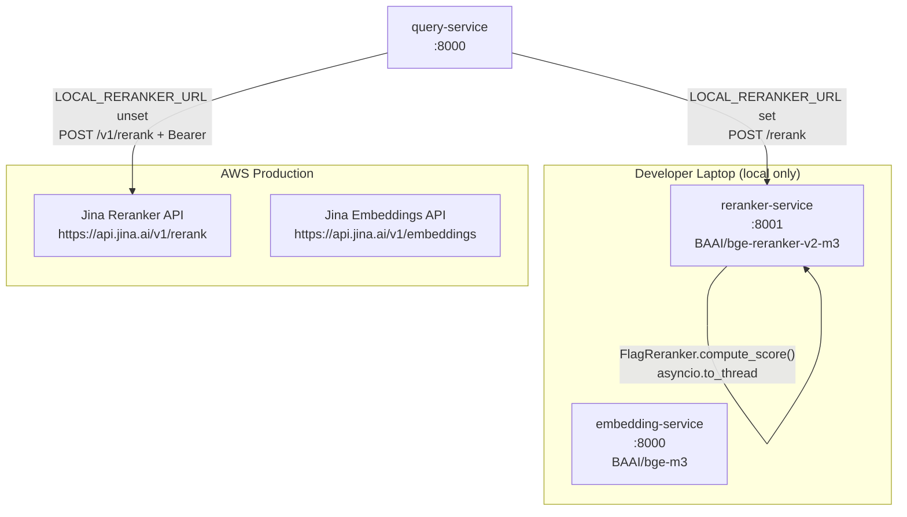
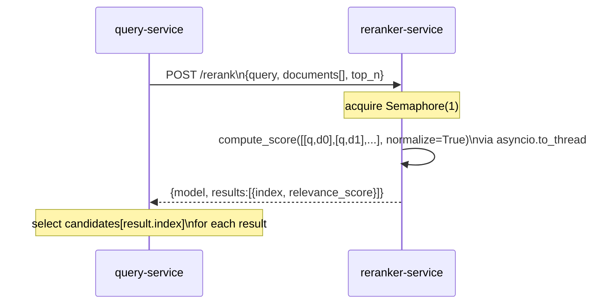

# reranker-service — Architecture

> Last updated: 2026-05-30

## 1. Service Overview

`reranker-service` is a local-only FastAPI inference service that wraps the **BAAI/bge-reranker-v2-m3** cross-encoder model. It exposes a single reranking endpoint whose request and response schemas are wire-compatible with Jina's hosted reranker API, allowing `query-service` to switch between the two providers via a single environment variable (`LOCAL_RERANKER_URL`).

**Role in the pipeline:** After pgvector retrieval returns a candidate set, `query-service` passes the query and candidate document texts to a reranker to produce a relevance-ordered shortlist. `reranker-service` fulfils that role locally, eliminating the Jina API dependency and its per-request cost for developer environments.

**Deployment scope:** Dev/local laptop only. AWS production continues to use the Jina hosted reranker. This matches the same "local-only" pattern established by `embedding-service` (port 8000, BAAI/bge-m3).

---

## 2. Architecture Diagram





---

## 3. Component Breakdown

| Component | File | Role |
|---|---|---|
| FastAPI app | `app/main.py` | Lifespan loads/unloads model; mounts router |
| Model loader | `app/model.py` | Module-global `FlagReranker`; concurrency semaphore; `asyncio.to_thread` wrapper |
| Routes | `app/api/routes.py` | `POST /rerank`, `GET /health`, `GET /ready` |
| Schemas | `app/schemas.py` | Pydantic models for request/response |
| Config | `app/config.py` | `pydantic-settings`; reads from `.env` |

### Model loading

The model is loaded exactly **once** during FastAPI lifespan startup via `asyncio.to_thread(reranker.load_model)`. It is held in a module-global `_model: FlagReranker | None`. On shutdown the global is set to `None` to release memory.

```python
# app/main.py — lifespan
await asyncio.to_thread(reranker.load_model)   # blocks off the event loop (~10–30 s)
yield
await asyncio.to_thread(reranker.unload_model)
```

### Concurrency control

A single `asyncio.Semaphore(settings.max_concurrent_inferences)` (default `1`) serializes inference calls. Cross-encoder inference is inherently sequential over pairs — one concurrent `compute_score` is the right default on a CPU-only host. The semaphore prevents multiple simultaneous calls from thrashing CPU threads.

### Score normalisation

Scores are sigmoid-normalised to `[0, 1]` by passing `normalize=True` to `FlagReranker.compute_score()`. This makes scores directly comparable to Jina's `relevance_score` field, preserving the wire-compatibility contract.

---

## 4. Data Flow

1. `query-service` calls `POST /rerank` with the user's original query and the raw text of each retrieved candidate chunk.
2. The route validates document count against `max_docs_per_request` (default `128`) and checks `is_loaded()`, returning `503` if the model is still warming up.
3. `model.rerank()` builds `[[query, doc], ...]` pairs, offloads `compute_score(pairs, normalize=True)` to a thread under the semaphore, then sorts `(original_index, score)` pairs descending.
4. If `top_n` is set, only the top N results are returned.
5. The response body contains `{model, results: [{index, relevance_score}]}` — `index` is the 0-based position in the original `documents` list.
6. `query-service` uses each `result.index` to look up the original `(DocumentChunk, vector_score)` tuple and replaces the score with `relevance_score`.

---

## 5. API Contract

### POST /rerank

**Request**
```json
{
  "query": "how does SQS visibility timeout work?",
  "documents": ["chunk text 0", "chunk text 1", "..."],
  "top_n": 8
}
```

| Field | Type | Required | Notes |
|---|---|---|---|
| `query` | `str` | yes | The user's natural-language question |
| `documents` | `list[str]` | yes | Raw text of each candidate chunk |
| `top_n` | `int \| null` | no | If omitted, all documents returned sorted by score |

**Response** (Jina-compatible)
```json
{
  "model": "BAAI/bge-reranker-v2-m3",
  "results": [
    {"index": 3, "relevance_score": 0.9134},
    {"index": 0, "relevance_score": 0.7821}
  ]
}
```

`relevance_score` is sigmoid-normalised to `[0, 1]`. `index` is the 0-based position of the document in the original request list.

**Error responses**

| Status | Condition |
|---|---|
| `422` | `len(documents) > max_docs_per_request` |
| `503` | Model not yet loaded (startup in progress) |

### GET /health

Always `200` while the process is up.
```json
{"status": "ok", "model_loaded": true}
```

### GET /ready

`200` once the model is loaded; `503` while still loading. Clients should poll `/ready` before sending `/rerank` requests at startup.
```json
{"status": "ready"}
```

---

## 6. Configuration & Environment

All settings are defined in `app/config.py` via `pydantic-settings` and read from `.env`.

| Env var | Default | Description |
|---|---|---|
| `APP_ENV` | `local` | Environment name |
| `LOG_LEVEL` | `INFO` | Python logging level |
| `SERVICE_PORT` | `8001` | Uvicorn listen port |
| `MODEL_NAME` | `BAAI/bge-reranker-v2-m3` | HuggingFace model ID |
| `USE_FP16` | `true` | fp16 inference — halves memory on CPU AVX |
| `MAX_CONCURRENT_INFERENCES` | `1` | Semaphore size for `compute_score` calls |
| `TORCH_NUM_THREADS` | `0` | `0` = let torch decide; pin on noisy hosts |
| `MAX_DOCS_PER_REQUEST` | `128` | Hard cap on documents per `/rerank` request |

---

## 7. Infrastructure & Deployment

**This service is dev/local only.** It is not deployed to AWS and has no ECR repository.

| Item | Value |
|---|---|
| Port | `8001` |
| Base image | `python:3.11-slim` |
| Model baked at build | Yes — `Dockerfile` runs a preload step so cold start is disk load, not download |
| AWS presence | None |

The Dockerfile preloads the model weights at image build time:
```dockerfile
RUN python -c "from FlagEmbedding import FlagReranker; FlagReranker('BAAI/bge-reranker-v2-m3', use_fp16=False, devices='cpu')"
```

Start the service locally:
```bash
cd reranker-service
uvicorn app.main:app --host 0.0.0.0 --port 8001
# Wait for "reranker-service ready" in logs, then /ready returns 200
```

---

## 8. Technology Stack

| Dependency | Version constraint | Purpose |
|---|---|---|
| `fastapi` | `>=0.111.0` | HTTP framework |
| `uvicorn[standard]` | `>=0.29.0` | ASGI server |
| `pydantic` | `>=2.7.0` | Schema validation |
| `pydantic-settings` | `>=2.2.0` | `.env` config |
| `FlagEmbedding` | `>=1.2.10` | `FlagReranker` wrapping BAAI/bge-reranker-v2-m3 |
| `torch` | `>=2.2.0` | CPU tensor inference |
| `numpy` | `>=1.26.0` | Score array handling |

No SQLAlchemy, asyncpg, boto3, or httpx — this service is a pure stateless inference endpoint.

---

## 9. Scalability & Reliability

- **Single-threaded inference by design.** Cross-encoder reranking over N pairs is O(N) sequential forward passes. The semaphore of 1 is intentional — more concurrent callers serialize, which is better than thrashing CPU with parallel torch calls.
- **Readiness probe.** The `/ready` endpoint returns `503` during the ~10–30 s model load. Callers must not send `/rerank` traffic before `/ready` returns `200`.
- **No retries in this service.** Retry logic lives in the caller (`query-service` uses `tenacity` with `stop_after_attempt(3)` and exponential backoff).
- **No persistence.** The service is entirely stateless — a restart simply requires waiting for the model to load again.

---

## 10. Security Considerations

- No authentication on endpoints — the service is bound to `localhost` in local usage and has no AWS exposure.
- No secrets are required.
- Document text submitted to `/rerank` is never logged at INFO level (`logger.debug` only).

---

## 11. Relationship to embedding-service

Both `reranker-service` and `embedding-service` follow the same local-inference pattern:

| Aspect | embedding-service | reranker-service |
|---|---|---|
| Model | BAAI/bge-m3 | BAAI/bge-reranker-v2-m3 |
| Library | `BGEM3FlagModel` | `FlagReranker` |
| Port | `8000` | `8001` |
| Concurrency | Semaphore(2) | Semaphore(1) |
| `asyncio.to_thread` | Yes | Yes |
| Model baked in image | Yes | Yes |
| AWS deployment | No | No |

---

## 12. Change Log

| Date | Change |
|---|---|
| 2026-05-30 | Initial document — service created. Local BAAI/bge-reranker-v2-m3 reranker replacing Jina for dev environments. Jina remains the AWS production reranker. |
